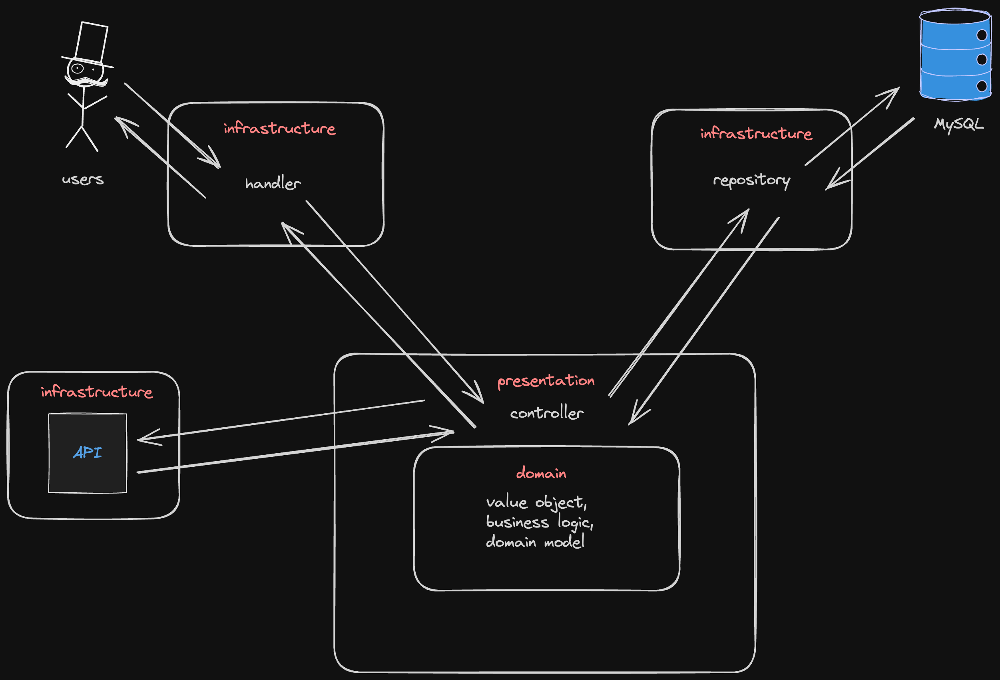
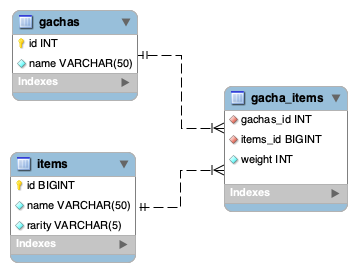

# go-unittest-architecture

[単体テストの考え方/使い方](https://www.amazon.co.jp/%E5%8D%98%E4%BD%93%E3%83%86%E3%82%B9%E3%83%88%E3%81%AE%E8%80%83%E3%81%88%E6%96%B9-%E4%BD%BF%E3%81%84%E6%96%B9-Vladimir-Khorikov/dp/4839981728)を読んで、テストの書き方、アーキテクチャについて再考するためのリポジトリ。モック、クリーンアーキテクチャを使わないような構成で簡単なAPIを書いてみる。

## 今回作るAPI

例の如くガチャのシュミレーションAPIを作成する。

- ガチャを抽選する(ランダム性のテスト)
- ガチャの決済APIを呼び出す(プロセス外依存を含んだテスト)

### Architecture



### DB



### EndPoint

#### ```/gacha/:gachaId/draw```

指定のガチャからアイテムを抽選する。

##### パスパラメーター

- gachaId ガチャID

##### HTTP メソッド

POST

##### Response

```
% curl -XPOST localhost:8080/gacha/1/draw | jq
{
  "id": 2,
  "name": "item2",
  "rarity": "N"
}
```

## 作成するテスト

### 単体テスト

- ガチャの抽選ロジック

### 結合テスト

以下の一連の呼び出しをテスト
- ガチャデータの取得 -> ガチャの抽選 -> 抽選したアイテムデータの取得 -> (決済APIの呼び出し)

### E2E

ゴールデンテストを使用してAPIリクエストからレスポンス取得までの一連の流れをテスト

## stack

- [wire](https://github.com/google/wire) 依存性の解決
- [sqlboiler](https://github.com/volatiletech/sqlboiler) ORM
- [golang-migtate](https://github.com/golang-migrate/migrate) マイグレーション
- [Taskfile](https://taskfile.dev/ja-JP/) タスクランナー
- dotenv + direnv 環境変数の管理

- [testify](https://github.com/stretchr/testify) アサーションに
- [dockertest](https://github.com/ory/dockertest) 結合テスト用にDB準備
- [gomock](https://github.com/uber-go/mock) モック
- [goldie](https://github.com/sebdah/goldie) ゴールデンテスト

- Go1.20
- MySql
- docker

### wire

#### install

```
go install github.com/google/wire/cmd/wire@latest
```

### golang-migrate

#### install 

```
brew install golang-migrate
```

### sqlbiler

#### install

```
go install github.com/volatiletech/sqlboiler/v4@latest
go install github.com/volatiletech/sqlboiler/v4/drivers/sqlboiler-mysql@latest
```

### Taskfile

#### install

```
brew install go-task
```

### gomock

#### install

```
go install go.uber.org/mock/mockgen@latest
```

## Task

```
% task
task: Available tasks for this project:
* generate:               execute `go generate` command. generate mock by `gomock` and di by `wire`.
* hello:                  Hello Test Task.
* db:connect:             Connect MySQL container.
* db:run:                 Run MySQL container.
* db:stop:                Stop MySQL container.When stop, container remove.
* generate:di:            execute `wire gen` command.
* migrate:create:         Create migration file.Migration name must be specified as an argument.ex) task migrate:create -- create_user_table
* migrate:down:           Execution migration down.
* migrate:force:          Execute force migration version.Migration version must be specified as an argument.ex)task migrate:force -- 2
* migrate:up:             Execution migration up.
* migrate:version:        Check current migration version.
* test:all:               execute all tests.
* test:e2e:               execute e2e tests.
* test:integration:       execute integration tests.
* test:unit:              execute unit tests.
* update:golden:          update golden file.
```

